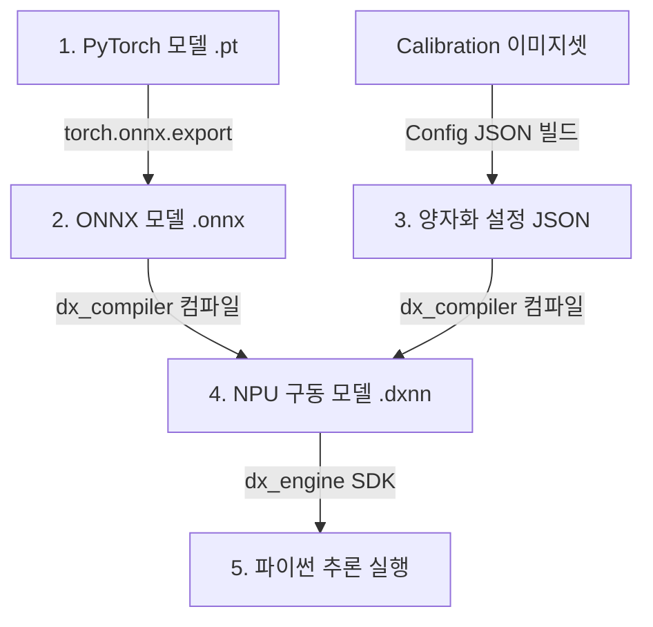

# DeepX NPU 개발 및 배포 워크플로우 가이드

이 문서는 PyTorch 모델을 ONNX 포맷으로 내보내고, DeepX NPU에서 실행 가능한 DXNN 포맷으로 변환(양자화 및 컴파일)한 다음, 파이썬 코드로 NPU에서 추론을 구동하는 전체 프로세스를 처음 접하는 개발자도 쉽게 따라 할 수 있도록 설명합니다.

---

## 전체 워크플로우 요약



---

## 1단계: PyTorch 모델을 ONNX로 변환 (PyTorch -> ONNX)

NPU 컴파일러에 모델을 입력하기 전, 공통 포맷인 **ONNX**로 변환해야 합니다. PyTorch 모델 파일(`.pt` 또는 `.pth`)을 로드하여 변환하는 코드 예제입니다.

### 📝 ONNX 익스포트 파이썬 코드 예제 (`pytorch_to_onnx.py`)

```python
import torch
import sys
# 실제 모델 정의 클래스가 정의된 모듈을 임포트해야 합니다.
# 예: from backbones import get_model

def export_to_onnx(pytorch_model_path, onnx_output_path):
    # 1. 모델 아키텍처 정의 및 가중치 로드
    # (여기서는 예시로 EdgeFace 모델 정의를 불러옵니다.)
    # model = get_model("edgeface_xs_gamma_06", fp16=False)
    
    # 예시를 위해 더미 백본 구조라고 가정합니다.
    # model.load_state_dict(torch.load(pytorch_model_path, map_location='cpu'))
    # model.eval()
    
    # 2. 더미 입력 데이터 생성 (배치 크기, 채널 수, 세로, 가로)
    # EdgeFace 입력 규격: (1, 3, 112, 112)
    dummy_input = torch.randn(1, 3, 112, 112)
    
    # 3. ONNX 파일로 내보내기
    print(f"Exporting PyTorch model to {onnx_output_path}...")
    torch.onnx.export(
        model,
        dummy_input,
        onnx_output_path,
        export_params=True,        # 모델 가중치를 파일에 패키징
        opset_version=11,          # DeepX NPU가 잘 지원하는 Opset 버전 (11 권장)
        do_constant_folding=True,  # 연산 최적화 활성화
        input_names=['input.1'],   # 입력 텐서 이름 정의 (임의 지정 가능)
        output_names=['output'],   # 출력 텐서 이름 정의 (임의 지정 가능)
        dynamic_axes={             # 배치 크기를 가변적으로 대응하도록 설정
            'input.1': {0: 'batch_size'},
            'output': {0: 'batch_size'}
        }
    )
    print("✅ ONNX Export 완료!")

# 실행 방법 예시
# export_to_onnx("checkpoints/edgeface_xs_gamma_06.pt", "checkpoints/edgeface_xs_gamma_06.onnx")
```

---

## 2단계: 양자화 Calibration Config 파일 준비

딥엑스 NPU는 모델 성능 및 속도 최적화를 위해 **INT8(8비트 정밀도) 양자화**를 수행합니다. 32비트 실수 실수가 8비트 정수로 변환될 때 생기는 정밀도 저하를 최소화하기 위해 **보정(Calibration)** 데이터셋과 설정 파일이 필요합니다.

### 1) Calibration 데이터셋 준비
- 모델의 정밀도를 대표할 수 있는 다양한 이미지 **100장 내외**를 준비합니다.
- 이미지는 모델의 입력 규격에 맞게 전처리(예: 112x112 크롭 및 리사이즈)된 상태여야 합니다.
- 이 이미지들을 특정 폴더(예: `npu_workflow_demo/calibration_dataset/`)에 몰아넣습니다.

### 2) 설정 파일 작성 (`calibration_config.json`)
아래와 같이 입력 정보, 양자화 알고리즘, 보정용 데이터셋 경로가 적힌 JSON 파일을 생성합니다.

```json
{
  "model_info": {
    "input_name": "input.1",
    "input_shape": [1, 3, 112, 112],
    "input_dtype": "float32"
  },
  "calibration_info": {
    "calibration_dataset_dir": "npu_workflow_demo/calibration_dataset",
    "calibration_num": 100,
    "calibration_method": "ema",
    "preprocessing": {
      "mean": [127.5, 127.5, 127.5],
      "std": [127.5, 127.5, 127.5],
      "swap_rb": true,
      "scale": 1.0
    }
  }
}
```
- `swap_rb`: OpenCV 이미지(BGR)를 RGB 형태로 변환하여 구동할 것인지 여부입니다.
- `mean` & `std`: 전처리 정규화 공식 $\frac{x - mean}{std}$를 컴파일러 내부 레이어로 삽입해 줍니다.

---

## 3단계: ONNX 모델을 NPU용 DXNN으로 컴파일

준비한 **ONNX 파일**과 **Calibration Config JSON**을 기반으로 DeepX NPU 전용 컴파일러인 `dx_compiler`를 구동하여 최종 바이너리 파일(`.dxnn`)을 생성합니다.

> ⚠️ **주의**: 컴파일 과정은 컴파일 엔진을 제공하는 호스트 PC나 개발 환경 서버에서 수행해야 합니다.

### 💻 컴파일 명령어 (Terminal)

```bash
dx_compiler \
    --model npu_workflow_demo/models/edgeface_xs_gamma_06.onnx \
    --config npu_workflow_demo/configs/calibration_config_edgeface_xs_gamma_06.json \
    --output npu_workflow_demo/models/edgeface_xs_gamma_06.dxnn \
    --target npu \
    --optimize
```

- `--model`: 변환할 ONNX 모델 경로
- `--config`: 2단계에서 작성한 양자화 JSON 설정 파일 경로
- `--output`: 컴파일 완성된 최종 NPU 파일 저장 경로 (`.dxnn` 확장자 필수)
- `--target npu`: 타겟 칩셋 디바이스 (NPU)로 지정
- `--optimize`: NPU의 하드웨어 특성에 맞춰 가중치를 최적화 배치함

이 명령어의 실행이 완료되면 최종적으로 `npu_workflow_demo/models/edgeface_xs_gamma_06.dxnn` 파일이 생성됩니다. 이 파일을 **라즈베리파이 보드**에 옮겨놓습니다.

---

## 4단계: 파이썬 코드로 NPU 추론 실행 (라즈베리파이에서)

라즈베리파이 보드에 딥엑스 구동 라이브러리(`dx_engine`) 및 컴파일된 `.dxnn` 모델 파일이 준비되었다면, 파이썬에서 NPU를 이용해 가속 추론을 실행합니다.

### 📝 NPU 추론 구동용 파이썬 코드 예제 (`npu_inference.py`)

```python
import cv2
import numpy as np
import sys

# 1. 딥엑스 dx_engine SDK 임포트
try:
    from dx_engine import InferenceEngine
    print("✅ dx_engine SDK가 성공적으로 로드되었습니다.")
except ImportError:
    print("❌ dx_engine을 찾을 수 없습니다. NPU SDK가 설치되어 있는지 확인하세요.")
    sys.exit(1)

def run_npu_inference():
    model_path = "npu_workflow_demo/models/edgeface_xs_gamma_06.dxnn"
    image_path = "npu_workflow_demo/test_images/lena.jpg"
    
    # 2. InferenceEngine에 DXNN 모델 파일 로드하여 NPU 구동 엔진 생성
    print("Loading DXNN model onto NPU...")
    ie = InferenceEngine(model_path)
    print(f"Model input dimensions expected: {ie.input_size()}")
    print(f"Model output format: {ie.output_dtype()}")
    
    # 3. 이미지 로드 및 전처리
    img = cv2.imread(image_path)
    if img is None:
        print(f"❌ 이미지를 찾을 수 없습니다: {image_path}")
        return
        
    # 모델 입력 크기(112x112)로 이미지 리사이즈
    resized = cv2.resize(img, (112, 112))
    
    # BGR 포맷을 RGB 포맷으로 변환
    rgb_img = cv2.cvtColor(resized, cv2.COLOR_BGR2RGB)
    
    # 입력 데이터의 Batch(배치 차원)를 추가하여 (1, 3, 112, 112) 또는 (1, 112, 112, 3) 텐서로 만듭니다.
    # 양자화 및 정규화(Mean/Std)는 컴파일러 내에 설정되었으므로 데이터 타입은 uint8로 변환해 줍니다.
    # (단, 모델 변환 설정에 따라 float32를 그대로 넣어주는 경우도 있습니다.)
    
    # HWC -> CHW로 형상 변환 (필요시)
    chw_img = np.transpose(rgb_img, (2, 0, 1))
    input_tensor = np.expand_dims(chw_img, axis=0).astype(np.uint8)
    
    # NPU 엔진 동작 성능과 메모리 얼라인을 위해 C-contiguous 형태로 선언
    input_tensor = np.ascontiguousarray(input_tensor)
    
    # 4. NPU 추론 실행
    print("🚀 NPU 가속 추론 시작...")
    ie.run(input_tensor)
    print("✅ 추론이 정상적으로 완료되었습니다.")
    
    # 5. NPU 결과 출력 수집
    outputs = ie.get_all_task_outputs()
    print(f"받은 출력 텐서 수: {len(outputs)}")
    
    # ⚠️ 중요: 모델 컴파일 결과에 따라 추출하려는 출력의 인덱스가 다릅니다!
    # EdgeFace 모델의 경우 outputs[1]이 실제 512차원 얼굴 특징 임베딩입니다.
    # (outputs[0]은 모델 변환 시 생성된 다른 보조 텐서입니다.)
    if len(outputs) >= 2:
        embedding = outputs[1]
    else:
        embedding = outputs[0]
        
    if isinstance(embedding, list):
        embedding = embedding[0]  # 리스트 래퍼 제거
        
    print(f"출력 임베딩 크기: {embedding.shape}")
    print(f"임베딩 벡터 일부 값: {embedding.flatten()[:10]}")

if __name__ == "__main__":
    run_npu_inference()
```

---

## 💡 개발 및 디버깅 꿀팁

1. **InferenceEngine 초기화 실패 시**:
   - `.dxnn` 모델 파일이 컴파일될 때 지정한 타겟 하드웨어(예: npu 칩 번호)와 실제 보드에 장착된 칩셋 정보가 일치하지 않으면 오작동합니다. 컴파일 시 타겟 아키텍처 옵션을 검토하세요.
2. **Inference 입력 경고 경감**:
   - `ie.run()`을 수행할 때 입력 데이터 numpy array가 메모리에 연속적으로 배치되지 않으면 경고가 뜰 수 있으므로, 반드시 `np.ascontiguousarray()`를 통과시킨 데이터를 입력해 주세요.
3. **양자화 후 정밀도 저하가 심할 때**:
   - Calibration 이미지 수량을 200장 이상으로 확대해 보거나, 정규화 공식(`mean`, `std`)이 PyTorch 학습 시 코드와 완전히 일치하는지 Config JSON 설정을 대조해 보세요.
