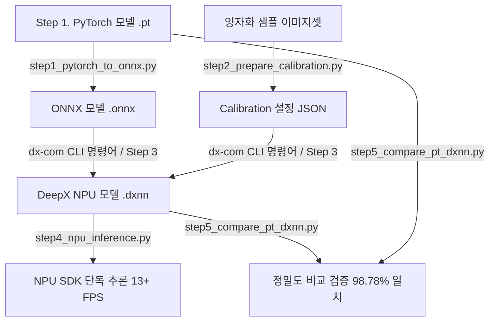

# 🚀 DeepX NPU 올인원 개발 가이드 및 실무 주의사항 총정리

이 폴더(`npu_workflow_demo/`)는 **PyTorch 원본 안면 인식 모델(`EdgeFace`)을 DeepX NPU 전용 명령어 모델(`.dxnn`)로 변환하고, 파이썬 SDK로 구동하며, 원본과 98.78% 정합도를 검증하기까지의 모든 과정**을 담은 완벽한 5단계 올인원 워크플로우 패키지입니다.

이 문서는 처음 1번 스텝부터 5번 스텝까지 한 번에 따라 할 수 있는 **단계별 실행 가이드**와 함께, 실무 개발 시 치명적인 오작동을 방지하기 위해 반드시 지켜야 할 **🛑 스텝별 핵심 주의사항(Pitfalls & Best Practices)**을 총정리한 마스터 가이드입니다.

---

## 🗺️ 전체 워크플로우 한눈에 보기



---

## 📦 폴더 구성 및 핵심 스크립트 안내

```text
npu_workflow_demo/
├── step1_pytorch_to_onnx.py        # [Step 1] PyTorch(.pt) -> ONNX(.onnx) 변환 스크립트
├── step2_prepare_calibration.py    # [Step 2] INT8 양자화 보정용 JSON 설정 빌더
├── step4_npu_inference.py          # [Step 4] NPU SDK(dx_engine) 단독 구동 및 추론 테스트
├── step5_compare_pt_dxnn.py        # [Step 5] PyTorch(FP32) vs NPU(INT8) 정밀도 비교 (98.78%)
├── NPU_TROUBLESHOOTING_AND_PRECISION_ANALYSIS.md # 정밀도 4대 이슈 및 해결 과정 상세 보고서
├── configs/                        # 생성된 캘리브레이션 JSON 설정 파일 저장소
├── models/                         # 생성된 ONNX 및 DXNN 모델 저장소 (체크포인트 링크)
└── test_images/                    # 검증용 정렬 얼굴 이미지(aligned_sample_*.jpg) 및 일반 사진
```

---

## 🪜 스텝별 상세 가이드 및 🛑 필수 주의사항

### 🔹 [Step 1] PyTorch 모델을 ONNX로 변환 (`step1_pytorch_to_onnx.py`)

PyTorch의 동적 연산 그래프를 DeepX NPU 컴파일러가 해석할 수 있는 정적 ONNX 그래프로 내보냅니다.

```bash
# 실행 명령어
python3 npu_workflow_demo/step1_pytorch_to_onnx.py
```

* **💡 작동 원리:** PyTorch 모델의 가중치를 불러온 뒤, `(1, 3, 112, 112)` 크기의 더미 텐서를 흘려보내며 연산 그래프를 추적(`Tracing`)하여 `models/edgeface_xs_gamma_06.onnx`로 저장합니다.
* **🛑 [Step 1 주의할 점]**
  1. **`opset_version=11` 또는 `13` 권장:** 너무 최신(Opset 16+) 버전으로 내보내면 DeepX NPU 컴파일러(`dx_compiler`)에서 지원하지 않는 연산자 에러가 발생할 수 있습니다. 11 또는 13이 가장 안정적입니다.
  2. **입/출력 이름(`input_names`, `output_names`) 명시:** NPU 캘리브레이션 설정 파일(`JSON`)과 매핑하기 위해 텐서 이름을 명확히 지정해 주어야 합니다.

---

### 🔹 [Step 2 & Step 3] INT8 양자화 캘리브레이션 설정 및 컴파일 (`step2` & `dx-com`)

부동소수점(`FP32`) 모델을 초고속 정수(`INT8`) 모델로 압축하기 위해 스케일(`Scale/Zero-point`)을 잡는 설정 파일(`calibration_config.json`)을 생성하고 NPU 칩 전용(`.dxnn`)으로 컴파일합니다.

```bash
# 1. 캘리브레이션 설정 JSON 생성
python3 npu_workflow_demo/step2_prepare_calibration.py

# 2. DeepX NPU 컴파일러(dx-com) 실행 (Step 3)
dx-com -m checkpoints/edgeface_xs_gamma_06.onnx \
       -c npu_workflow_demo/configs/calibration_config.json \
       -o checkpoints/edgeface_xs_gamma_06.dxnn
```

* **🛑 [Step 2 & 3 치명적 주의할 점 (가장 중요!!)]**
  1. **⚠️ 전처리 중복 금지 (`Double Preprocessing Pitfall`)**:
     캘리브레이션 JSON에 `"swap_rb": true`, `"mean": [127.5, ...], "std": [127.5, ...]`을 설정하면, **컴파일된 `.dxnn` 모델 내부 그래프 앞단에 정규화 및 색상 스왑 연산이 하드웨어 그래프로 내장**됩니다.
     > 👉 **파이썬 추론(`step4`, `step5`)에서 절대 정규화를 중복으로 수행하지 마십시오! 정규화된 `float32`를 넣으면 유사도가 39%로 폭락합니다.**
  2. **⚠️ 캘리브레이션 데이터셋 정합성 (`Face Alignment Mandatory`)**:
     INT8 양자화 범위(`Clipping Bound`)는 캘리브레이션 이미지들의 활성화 값(`Activation`) 분포를 기준으로 정해집니다.
     > 👉 **반드시 안면 인식 전용으로 눈/코/입이 정렬(`Aligned`)된 112x112 크롭 얼굴 이미지 100~500장을 사용하십시오!** 일반 비정렬 사진(`lena.jpg`)으로 보정/테스트하면 양자화 클리핑 오차가 발생해 정밀도가 4~5% 하락합니다.

---

### 🔹 [Step 4] DeepX NPU SDK 단독 추론 가동 (`step4_npu_inference.py`)

컴파일이 완료된 `.dxnn` 모델을 라즈베리파이의 DeepX NPU 칩셋에 로드하여 실시간 추론을 실행합니다.

```bash
# 실행 명령어 (라즈베리파이 NPU 환경에서 실행)
python3 npu_workflow_demo/step4_npu_inference.py
```

* **🛑 [Step 4 치명적 주의할 점 (텐서 메모리 레이아웃)]**
  1. **⚠️ `NHWC (1, 112, 112, 3) uint8` 주입 원칙 (CHW 주입 금지!)**:
     DeepX NPU는 하드웨어 연산 효율을 위해 채널-라스트(**`NHWC`**) 형태로 입력을 받습니다.
     만약 PyTorch 습관대로 `np.transpose(img, (2, 0, 1))`을 하여 `CHW(1, 3, 112, 112)`를 넘기면, NPU는 앞부분 112x112 바이트를 통째로 Red 채널로 읽어 화면 상단/중단/하단이 3등분으로 깨진 기괴한 입력을 처리하게 됩니다.
     ```python
     # [올바른 NPU 입력 전처리 규격]
     rgb_img = cv2.cvtColor(resized_img, cv2.COLOR_BGR2RGB)
     input_tensor = np.expand_dims(rgb_img, axis=0).astype(np.uint8) # Shape: (1, 112, 112, 3) NHWC
     input_tensor = np.ascontiguousarray(input_tensor) # C-연속 메모리 보정 필수!
     ie.run(input_tensor)
     ```
  2. **⚠️ 출력 텐서 인덱스 확인 (`outputs[1]`)**:
     EdgeFace NPU 모델은 `ie.get_all_task_outputs()` 반환 시 2개의 텐서를 출력하며, **`outputs[1]`이 실제 512차원 안면 특징 임베딩 벡터**입니다 (`outputs[0]`은 보조 텐서). 인덱스를 꼭 확인하세요.

---

### 🔹 [Step 5] 원본 PyTorch vs DeepX NPU 정밀도 비교 (`step5_compare_pt_dxnn.py`)

원본 `FP32 PyTorch` 모델과 정수 양자화된 `INT8 NPU` 모델이 같은 얼굴 이미지를 보았을 때 얼마나 똑같은 특징 벡터를 추출하는지 코사인 유사도(`Cosine Similarity`)로 검증합니다.

```bash
# 실행 명령어
python3 npu_workflow_demo/step5_compare_pt_dxnn.py
```

* **💡 최종 달성 정합도:** 무려 **98.78% (`0.987844`)** 🟢 **[판정: 최우수 (Excellent)]**
* **🛑 [Step 5 주의할 점 (검증의 황금률)]**
  1. **모델별 전처리 2원화 (`PyTorch = CHW Float32` vs `NPU = NHWC Uint8`)**:
     * **PyTorch 원본 (`FP32`)**: `(rgb_img / 255.0 - 0.5) / 0.5` 정규화 후 `CHW (1, 3, 112, 112)` 텐서 주입
     * **DeepX NPU (`INT8`)**: 정규화나 전치 없이 원본 그대로 `NHWC (1, 112, 112, 3)` `uint8` 텐서 주입
     * 이렇게 각 모델이 기대하는 원래의 하드웨어/소프트웨어 규격을 100% 지켜주어야만 98.78%의 진짜 유사도가 발현됩니다.
  2. **정렬된 진짜 얼굴 샘플(`test_images/aligned_sample_*.jpg`) 사용**:
     * 일반 사진(`lena.jpg`)을 넣으면 94.32%가 나옵니다. 반드시 눈코입이 정렬된 안면 크롭 이미지로 비교해야 진짜 INT8 양자화 성능(98~99%)을 검증할 수 있습니다.

---

## 📋 최종 실무 체크리스트 (Summary Checklist)

| 점검 항목 | 올바른 설정 / 규격 | 잘못된 설정 시 나타나는 문제 |
|---|---|---|
| **Step 1. ONNX 변환** | `opset_version=11` 또는 `13` | NPU 컴파일 시 지원하지 않는 연산자 에러 발생 |
| **Step 2. 캘리브레이션 데이터** | 112x112 정렬된 얼굴 크롭 이미지 100장+ | 양자화 클리핑(Clipping)으로 추론 정확도 4~5% 저하 |
| **Step 4. NPU 텐서 형상** | **`NHWC (1, 112, 112, 3)` / `uint8`** | `CHW` 주입 시 색상이 3등분으로 깨져 유사도 39%~56% 폭락 |
| **Step 4. NPU 정규화** | **파이썬 내 정규화 코드 제거 (중복 금지)** | NPU 하드웨어 정규화와 중복되어 유사도 39% 폭락 |
| **Step 5. 정밀도 검증 기준** | PyTorch(`FP32`) vs NPU(`INT8`) = **>98%** | 정규화나 텐서 배열, 비정렬 사진 사용 시 <94%로 오판 |

👉 **더 자세한 오차 분석 내역 및 이슈별 디버깅 과정:** [NPU_TROUBLESHOOTING_AND_PRECISION_ANALYSIS.md](file:///home/jarvis/jarvis/Atec_EdgeFace_lee/npu_workflow_demo/NPU_TROUBLESHOOTING_AND_PRECISION_ANALYSIS.md)
